# Marketplace Artesanal · TFM

[](https://github.com/Ignarts/TFM_IgnacioMelendez_MarketplaceArtesanal/actions/workflows/ci.yml)


> Trabajo Fin de Máster · Máster Full Stack Developer (MEDAC)
> Autor: **Ignacio Meléndez**

Plataforma **multivendedor** de productos artesanales (cerámica, joyería, cuero, ilustración,
textil, madera…), tipo Etsy a pequeña escala. Un mismo usuario puede **comprar** y, si lo desea,
abrir su propia tienda para **vender**. El proyecto se articula en torno a dos ejes técnicos:
la **seguridad por roles con regla de propiedad (RBAC + ownership)** y un **sistema de reputación
y confianza** entre desconocidos.

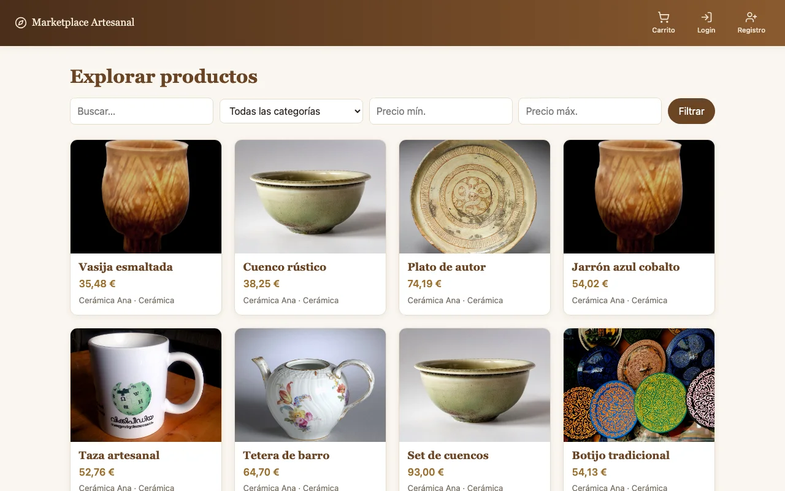

> 🛈 **Sin pagos reales.** El checkout es simulado: el pedido recorre los estados
> `PENDING → PAID → SHIPPED → DELIVERED`, pero no hay pasarela de pago. Todo lo demás (roles,
> stock, reputación, pedidos, moderación) funciona de extremo a extremo.

## Índice

- [Estado del proyecto](#-estado-del-proyecto)
- [Funcionalidades](#-funcionalidades)
- [Sistema de reputación](#-sistema-de-reputación-el-twist)
- [Seguridad y autorización](#-seguridad-y-autorización)
- [Arquitectura](#-arquitectura)
- [Stack tecnológico](#-stack-tecnológico)
- [Puesta en marcha](#-puesta-en-marcha)
- [API REST](#-api-rest)
- [Tests y CI](#-tests-y-ci)
- [Estructura del repositorio](#-estructura-del-repositorio)
- [Documentación](#-documentación)

## 📌 Estado del proyecto

Los cuatro hitos del [roadmap](docs/08-roadmap.md) están completados. Solo queda pendiente la
redacción del análisis comparativo de la memoria.

| Hito | Alcance | Estado |
|------|---------|:------:|
| **M0 · Cimientos** | Spring Boot + Angular, Docker Compose, registro/login con JWT, guards e interceptor. | ✅ |
| **M1 · Catálogo y tiendas** | Tiendas, productos y categorías; alta de vendedor; CRUD con regla de propiedad; explorador con filtros. | ✅ |
| **M2 · Compra y reseñas** | Carrito, checkout simulado (un pedido por tienda), ciclo de estados y reseñas verificadas. | ✅ |
| **M3 · Twist y calidad** | Reputación con score e insignias, panel de administración, tests y CI. | ✅ |
| **Extras** | Favoritos, reportes y moderación, respuestas del vendedor a reseñas, retirada de productos, suspensión de usuarios, gestión de categorías y perfil con KPIs. | ✅ |

## ✨ Funcionalidades

Los roles son **acumulables**: todo usuario registrado es comprador (`BUYER`); al abrir una
tienda pasa a ser también vendedor (`SELLER`); el administrador (`ADMIN`) gestiona la plataforma.

### 🛍️ Comprador

- **Explorador** público con búsqueda por texto y filtros por categoría y rango de precio.
- **Ficha de producto** con galería, valoración media, reseñas (con la respuesta del vendedor) y
  la tarjeta de la tienda con su **score de reputación** e insignias.
- **Carrito** en el navegador y **checkout** que valida el stock, congela el precio de cada línea
  y genera **un pedido por tienda**.
- **Mis pedidos**: pago simulado, confirmación de recepción y acceso a valorar la compra.
- **Reseñas verificadas**: solo puede reseñar quien ha recibido el producto, y solo una vez.
- **Favoritos**, **reportes** de productos o reseñas inapropiados y **perfil** con KPIs y
  actividad reciente.

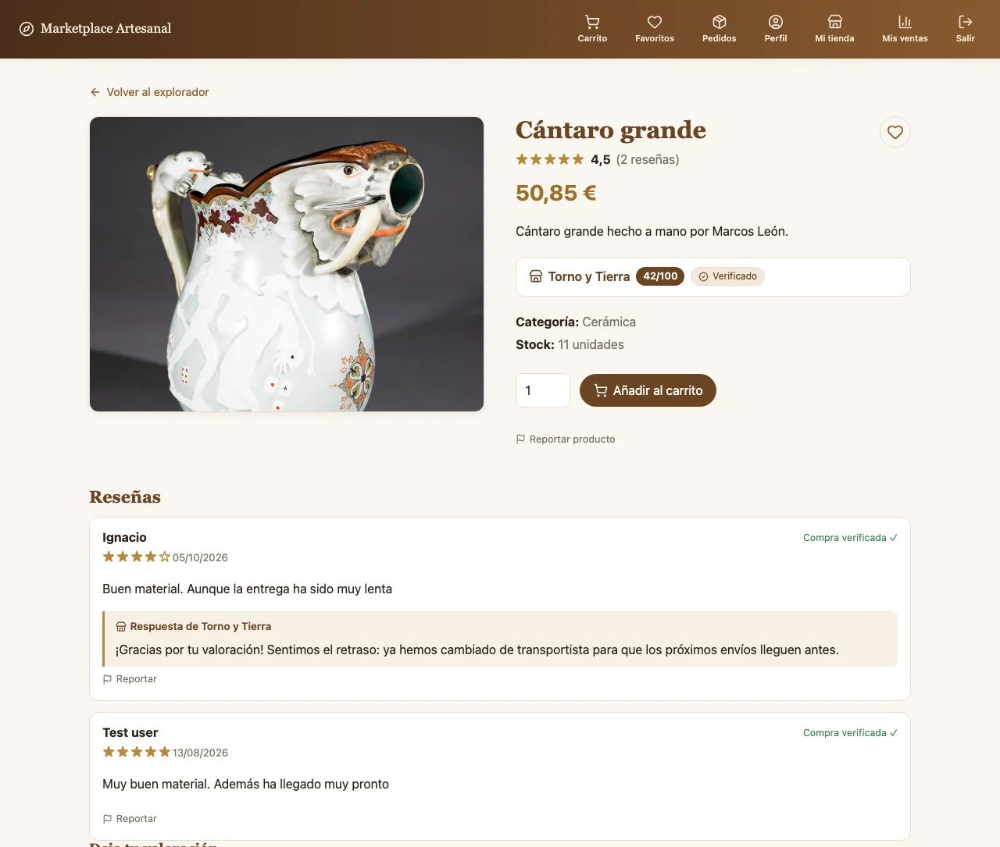

<table>
  <tr>
    <td width="50%">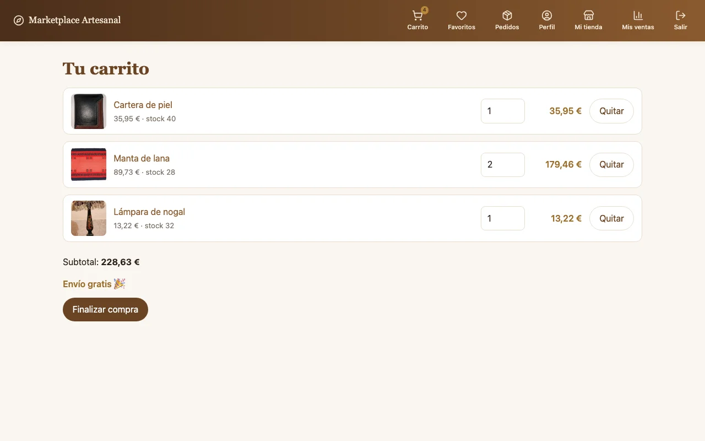<br><sub><b>Carrito</b>: productos de varias tiendas; el checkout genera un pedido por tienda.</sub></td>
    <td width="50%">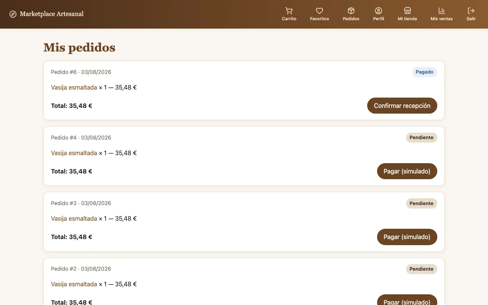<br><sub><b>Mis pedidos</b>: cada estado ofrece su acción (pagar, confirmar recepción, valorar).</sub></td>
  </tr>
  <tr>
    <td width="50%">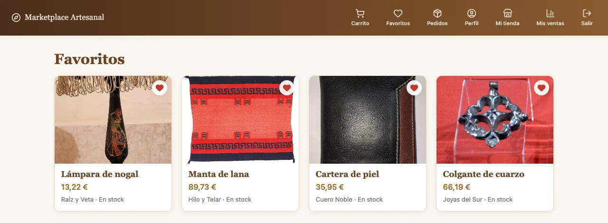<br><sub><b>Favoritos</b>: lista de deseos persistida en el backend.</sub></td>
    <td width="50%">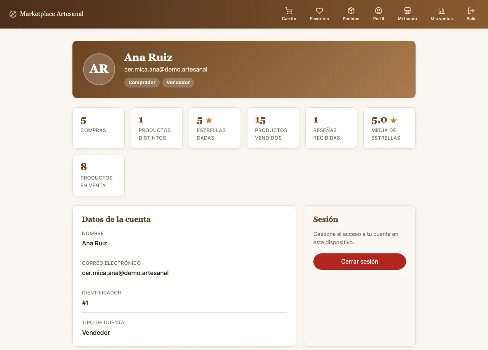<br><sub><b>Perfil</b>: KPIs como comprador y como vendedor, y actividad reciente.</sub></td>
  </tr>
</table>

### 🏺 Vendedor

- **Alta de vendedor** desde `/vender`: abrir una tienda otorga el rol `SELLER`.
- **Mi tienda**: editar los datos de la tienda, ver su reputación y KPIs, y gestionar el
  catálogo (crear, editar y borrar productos con imágenes, precio y stock). Un producto que ya se
  ha vendido no se puede borrar.
- **Reseñas recibidas**: el vendedor puede **responder** públicamente a cada reseña.
- **Mis ventas**: pedidos recibidos, ingresos, pedidos pendientes de envío y acción
  **marcar como enviado**.

<table>
  <tr>
    <td width="50%">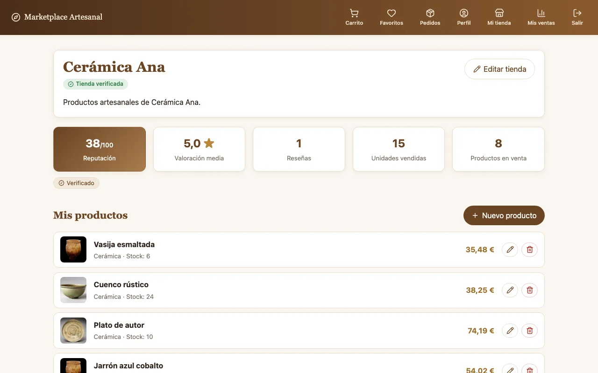<br><sub><b>Mi tienda</b>: reputación, KPIs y gestión del catálogo.</sub></td>
    <td width="50%">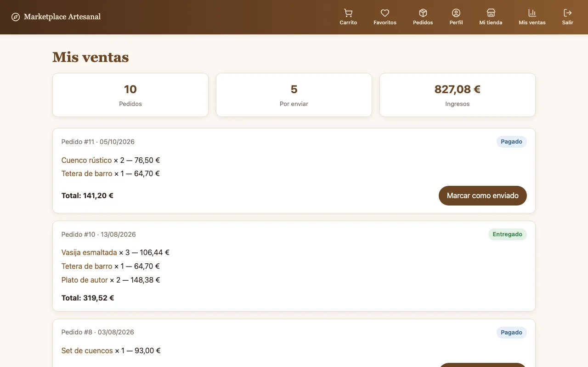<br><sub><b>Mis ventas</b>: pedidos recibidos y envío.</sub></td>
  </tr>
</table>

### 🛡️ Administración

Backoffice en `/admin`, protegido por rol, con seis secciones:

| Sección | Qué permite |
|---------|-------------|
| **Reportes** | Revisar el contenido señalado por los usuarios: retirar el producto, eliminar la reseña o descartar el reporte. |
| **Tiendas** | Verificar tiendas pendientes; la verificación otorga la insignia y recalcula la reputación. |
| **Usuarios** | Suspender y reactivar cuentas. Una cuenta suspendida pierde el acceso al instante, aunque su token siga vigente. |
| **Reseñas** | Moderar y eliminar reseñas. |
| **Productos retirados** | Ver y restaurar productos ocultos del catálogo. |
| **Categorías** | Crear, renombrar y borrar categorías (no se borra una categoría en uso). |

<table>
  <tr>
    <td width="50%">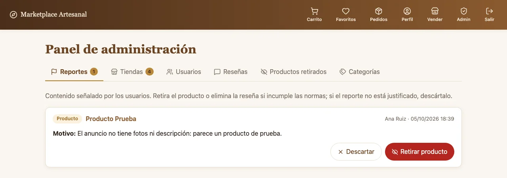<br><sub><b>Reportes</b> pendientes de moderar.</sub></td>
    <td width="50%">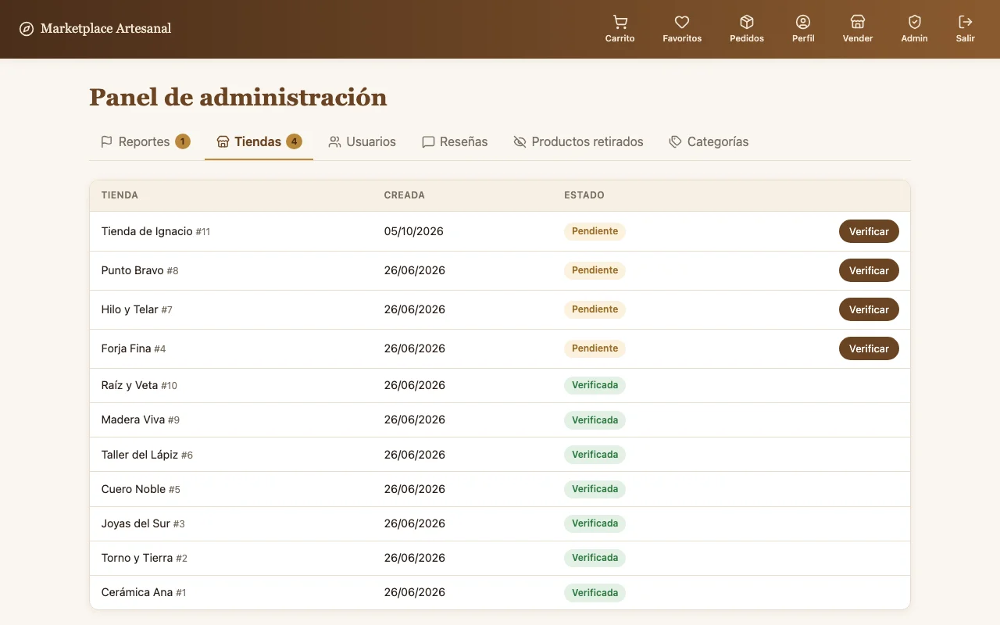<br><sub><b>Tiendas</b>: verificación de vendedores.</sub></td>
  </tr>
</table>

### 📦 Ciclo de vida del pedido

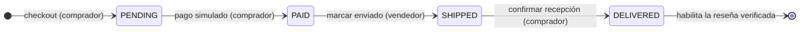

Cada transición comprueba **quién** la ejecuta: solo el comprador del pedido puede pagarlo o
confirmarlo, y solo el dueño de la tienda puede marcarlo como enviado.

## ⭐ Sistema de reputación (el *twist*)

La pregunta de investigación del TFM es **cómo genera confianza una plataforma entre dos
desconocidos**. La respuesta implementada es un **score de 0 a 100 por tienda**
(`ReputationService`):

```
score = 0.40 · valoraciónMedia / 5          (calidad percibida)
      + 0.30 · min(ventas / 100, 1)          (trayectoria)
      + 0.20 · min(antigüedadDías / 365, 1)  (veteranía)
      − 0.10 · tasaIncidencias               (penalización)
```

- Se recalcula **cada hora** con `@Scheduled` y **al momento** cuando un admin verifica la tienda.
- Se muestra en la ficha de producto y en el panel del vendedor.

| Insignia | Condición |
|----------|-----------|
| **Verificado** | Tienda verificada por un administrador. |
| **Destacado** | Score > 85. |
| **Respuesta rápida** | Al menos 10 ventas y tasa de incidencias < 5 %. |
| **+100 ventas** | 100 o más pedidos entregados. |

**Antifraude**: las reseñas exigen un pedido entregado, hay una reseña por comprador y producto,
los usuarios pueden reportar contenido y el administrador lo modera.

> El marco teórico y la comparativa con eBay, Wallapop, Etsy y Stack Overflow están en
> [docs/06-sistema-reputacion.md](docs/06-sistema-reputacion.md).

## 🔐 Seguridad y autorización

La autorización combina dos capas:

1. **RBAC**: cada endpoint declara qué rol lo puede usar (`@PreAuthorize("hasRole('SELLER')")`).
2. **Regla de propiedad**: en los servicios se comprueba que el recurso pertenece al usuario
   (un vendedor solo edita *sus* productos, solo envía *sus* pedidos y solo responde reseñas de
   *su* tienda).

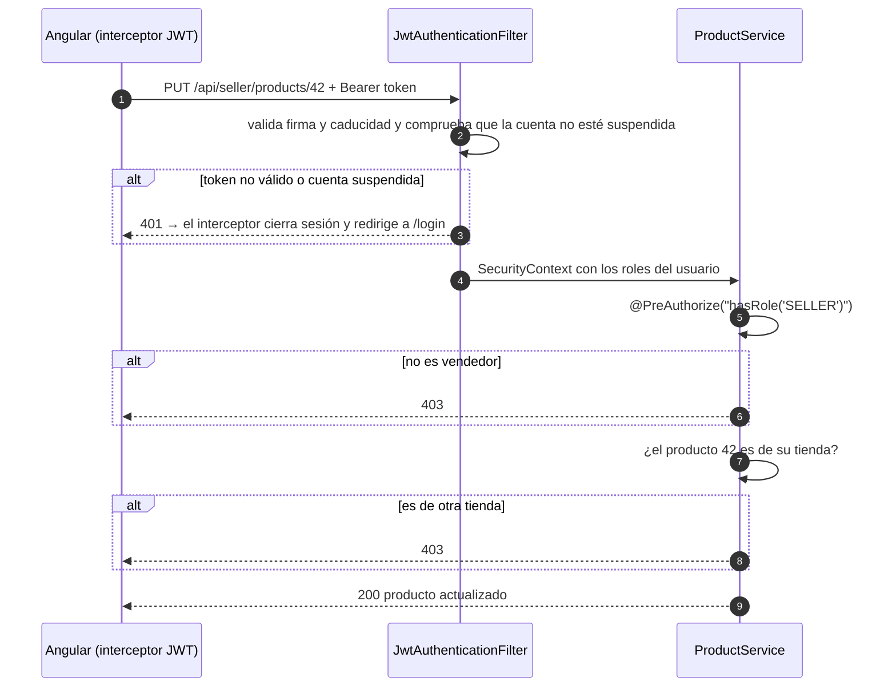

En el frontend, las rutas se protegen con **guards funcionales** (`authGuard`, `roleGuard('SELLER')`,
`roleGuard('ADMIN')`), el menú se adapta al rol y todas las pantallas se cargan con **lazy loading**.
Detalle completo y matriz de endpoints en [docs/05-seguridad-rbac.md](docs/05-seguridad-rbac.md).

## 🧩 Arquitectura

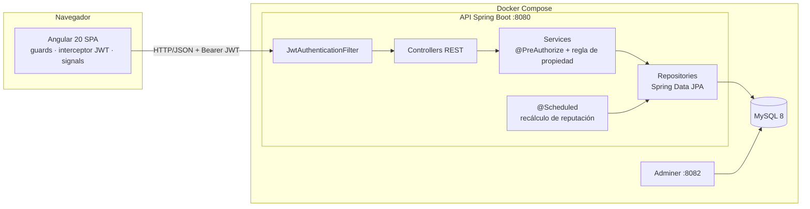

El backend está organizado **por funcionalidad** (`auth`, `shop`, `product`, `order`, `review`,
`reputation`, `report`, `wishlist`, `admin`…), cada paquete con su entidad, repositorio, servicio,
controlador y DTOs.

### Modelo de datos

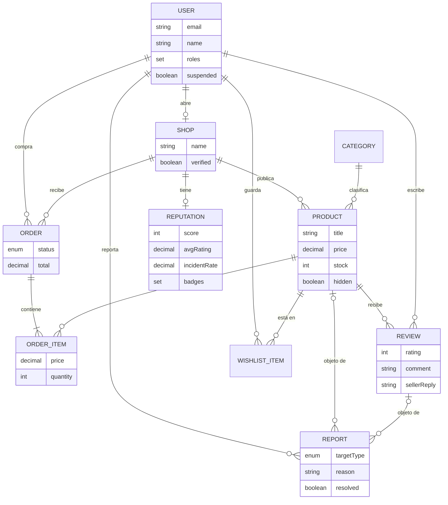

El precio se **congela** en cada `OrderItem` en el momento de la compra. Más detalle en
[docs/04-modelo-de-datos.md](docs/04-modelo-de-datos.md).

## 🧱 Stack tecnológico

| Capa | Tecnologías |
|------|-------------|
| **Frontend** | Angular 20 (componentes *standalone*, signals, lazy loading) · Reactive Forms · RxJS · guards funcionales · interceptor JWT · Lucide icons · SCSS |
| **Backend** | Java 17 · Spring Boot 3.2 · Spring Web · Spring Security (JWT con jjwt) · Spring Data JPA · Bean Validation · `@PreAuthorize` · `@Scheduled` · springdoc-openapi |
| **Persistencia** | MySQL 8 (Docker) · H2 en memoria (tests) |
| **Calidad / Deploy** | JUnit 5 · Mockito · MockMvc · Jasmine/Karma · Dockerfile multi-stage · Docker Compose · GitHub Actions |

## 🚀 Puesta en marcha

Requisitos: **Docker + Docker Compose** (backend y base de datos) y **Node 20+** (frontend).

```bash
# 1. Variables de entorno: copia la plantilla y genera un secreto JWT
cp .env.example .env
#    Edita .env y pon un JWT_SECRET largo, por ejemplo: openssl rand -base64 64

# 2. Backend + MySQL + Adminer, con datos de demostración
APP_SEED_DEMO=true docker compose up --build

# 3. Frontend (en otra terminal)
cd frontend && npm install && npm start
```

> El backend no tiene *hot reload*: tras cambiar código Java hay que reconstruir la imagen con
> `docker compose up -d --build api`.

### 🌐 URLs

| Servicio | URL | Descripción |
|----------|-----|-------------|
| **Frontend (SPA)** | http://localhost:4200 | Aplicación Angular. |
| **API REST** | http://localhost:8080/api | Endpoints de la API. |
| **Swagger UI** | http://localhost:8080/swagger-ui.html | Documentación interactiva de la API. |
| **OpenAPI (JSON)** | http://localhost:8080/v3/api-docs | Especificación OpenAPI. |
| **Adminer** | http://localhost:8082 | Visor de la BBDD: motor `MySQL`, servidor `mysql`, usuario/contraseña/BBDD `marketplace`. |
| **MySQL** | `localhost:3306` | Base de datos (credenciales en `.env`). |

La API tarda unos segundos en arrancar (espera a la línea `Started MarketplaceApplication`).

### 🌱 Datos de demostración

Con `APP_SEED_DEMO=true`, `DemoDataSeeder` crea **10 tiendas y unos 70 productos** con fotos
reales. Está desactivado por defecto, no se ejecuta en los tests y es idempotente (no vuelve a
sembrar si los datos ya existen).

- Cada vendedor demo entra con el email `<tienda>@demo.artesanal` y la contraseña `password123`.
  Por ejemplo: `cer.mica.ana@demo.artesanal` (tienda *Cerámica Ana*).
- Las imágenes son fotos de [Wikimedia Commons](https://commons.wikimedia.org) (contenido de libre
  uso). Las URLs se obtuvieron **una sola vez** con la API de búsqueda de Commons, filtrando
  imágenes cuyo título contiene el objeto buscado, y están escritas como literales en el seeder.
  En el arranque no se llama a ninguna API externa. Las imágenes se sirven directamente desde el
  CDN de Wikimedia.

### 🛡️ Crear un administrador

No hay registro de administradores desde la interfaz, por diseño. Regístrate con un usuario normal
y añádele el rol `ADMIN` en la base de datos:

```bash
docker compose exec mysql mysql -umarketplace -pmarketplace marketplace \
  -e "INSERT INTO user_roles (user_id, role) SELECT id, 'ADMIN' FROM users WHERE email = 'tu@email.com';"
```

Cierra sesión y vuelve a entrar para que el menú muestre el enlace **Admin**.

### ✅ Prueba rápida de la API

```bash
# Registro, login y endpoint protegido
curl -X POST localhost:8080/api/auth/register -H "Content-Type: application/json" \
  -d '{"email":"ana@test.com","password":"password123","name":"Ana"}'

TOKEN=$(curl -s -X POST localhost:8080/api/auth/login -H "Content-Type: application/json" \
  -d '{"email":"ana@test.com","password":"password123"}' | sed 's/.*"token":"\([^"]*\)".*/\1/')

curl localhost:8080/api/me -H "Authorization: Bearer $TOKEN"

# Abrir una tienda (otorga ROLE_SELLER) y publicar un producto
curl -X POST localhost:8080/api/seller/shop -H "Authorization: Bearer $TOKEN" \
  -H "Content-Type: application/json" -d '{"name":"Cerámica Ana"}'

curl -X POST localhost:8080/api/seller/products -H "Authorization: Bearer $TOKEN" \
  -H "Content-Type: application/json" \
  -d '{"title":"Vasija","price":19.90,"stock":5,"categoryId":1}'
```

## 🔌 API REST

La especificación completa está en **Swagger UI**. Resumen por rol:

<details>
<summary><b>Público y autenticación</b></summary>

| Endpoint | Método | Acceso | Descripción |
|----------|--------|--------|-------------|
| `/api/auth/register` | `POST` | público | Registro (rol `BUYER`). |
| `/api/auth/login` | `POST` | público | Login; devuelve el JWT y los roles. `403` si la cuenta está suspendida. |
| `/api/categories` | `GET` | público | Listado de categorías. |
| `/api/products` | `GET` | público | Explorador con filtros `q`, `categoryId`, `minPrice`, `maxPrice`. |
| `/api/products/{id}` | `GET` | público | Ficha de producto (los productos retirados devuelven `404`). |
| `/api/products/{id}/reviews` | `GET` | público | Reseñas de un producto con la respuesta del vendedor. |
| `/api/shops/{shopId}/reputation` | `GET` | público | Score, métricas e insignias de una tienda. |

</details>

<details>
<summary><b>Comprador</b> (cualquier usuario autenticado)</summary>

| Endpoint | Método | Descripción |
|----------|--------|-------------|
| `/api/me` · `/api/me/profile-stats` | `GET` | Datos del usuario y KPIs del perfil. |
| `/api/orders` | `POST` | Checkout: valida el stock, lo descuenta y crea **un pedido por tienda**. |
| `/api/orders` | `GET` | Histórico de mis pedidos. |
| `/api/orders/{id}/pay` | `POST` | Pago simulado `PENDING → PAID` (solo el comprador). |
| `/api/orders/{id}/confirm` | `POST` | Confirmar recepción `SHIPPED → DELIVERED` (solo el comprador). |
| `/api/products/{id}/reviews` | `POST` | Reseña verificada: requiere un pedido entregado; una por producto. |
| `/api/me/wishlist` | `GET` | Mis favoritos. |
| `/api/me/wishlist/{productId}` | `PUT` · `DELETE` | Añadir o quitar de favoritos. |
| `/api/reports` | `POST` | Reportar un producto o una reseña (un reporte abierto por usuario y objetivo). |

</details>

<details>
<summary><b>Vendedor</b> (<code>SELLER</code>)</summary>

| Endpoint | Método | Descripción |
|----------|--------|-------------|
| `/api/seller/shop` | `POST` · `GET` | Abrir tienda (otorga `SELLER`) y consultarla. |
| `/api/seller/shop` | `PUT` | Editar nombre y descripción de mi tienda. |
| `/api/seller/products` | `GET` · `POST` | Listar y crear productos de mi tienda. |
| `/api/seller/products/{id}` | `PUT` · `DELETE` | Editar o borrar **con regla de propiedad** (no se borra un producto ya vendido). |
| `/api/seller/orders` | `GET` | Pedidos recibidos por mi tienda. |
| `/api/seller/orders/{id}/ship` | `POST` | Marcar como enviado `PAID → SHIPPED` (**regla de propiedad**). |
| `/api/seller/reviews` | `GET` | Reseñas de mis productos. |
| `/api/seller/reviews/{id}/reply` | `PUT` | Responder (o editar la respuesta) a una reseña (**regla de propiedad**). |

</details>

<details>
<summary><b>Administrador</b> (<code>ADMIN</code>)</summary>

| Endpoint | Método | Descripción |
|----------|--------|-------------|
| `/api/admin/shops` · `/api/admin/shops/pending` | `GET` | Todas las tiendas y las pendientes de verificar. |
| `/api/admin/shops/{id}/verify` | `POST` | Verificar tienda y recalcular su reputación. |
| `/api/admin/users` | `GET` | Listado de usuarios. |
| `/api/admin/users/{id}/suspend` · `/unsuspend` | `POST` | Suspender o reactivar (no puede suspenderse a sí mismo). |
| `/api/admin/reviews` | `GET` | Listado de reseñas. |
| `/api/admin/reviews/{id}` | `DELETE` | Eliminar una reseña. |
| `/api/admin/reports` | `GET` | Reportes abiertos. |
| `/api/admin/reports/{id}/dismiss` | `POST` | Descartar un reporte. |
| `/api/admin/products/hidden` | `GET` | Productos retirados. |
| `/api/admin/products/{id}/hide` · `/restore` | `POST` | Retirar o restaurar un producto. |
| `/api/admin/categories` | `POST` | Crear categoría. |
| `/api/admin/categories/{id}` | `PUT` · `DELETE` | Editar o borrar categoría (no si está en uso). |

</details>

## 🧪 Tests y CI

```bash
cd backend && ./mvnw test                                    # backend (H2 en memoria)
cd frontend && npm test -- --watch=false --browsers=ChromeHeadless   # frontend
```

- **Backend**: 49 tests en dos niveles.
  - **Unitarios** con Mockito: `AuthService`, `JwtService`, `OrderService`, `ProductService` y
    `ReputationService` (fórmula del score e insignias).
  - **De flujo** con `@SpringBootTest` y MockMvc contra H2: autenticación, catálogo, compra y
    reseña, tienda del vendedor, administración, categorías y suspensión, moderación y favoritos.
    Recorren la API real con distintos roles y comprueban los `401`/`403` de la autorización
    por rol y por propiedad.
- **Frontend**: Jasmine/Karma para `AuthService` y el interceptor JWT.
- **CI**: GitHub Actions ([`ci.yml`](.github/workflows/ci.yml)) ejecuta en cada *push* y *pull
  request* `./mvnw verify` para el backend y los tests de Karma en Chrome headless para el
  frontend.

## 📁 Estructura del repositorio

```
.
├── backend/                     # API REST Spring Boot (Java 17)
│   └── src/main/java/com/marketplace/
│       ├── auth/  security/  config/   # registro/login, filtro JWT, SecurityConfig, OpenAPI
│       ├── user/  me/                  # usuarios, roles, perfil y KPIs
│       ├── shop/  product/  category/  # catálogo y tiendas
│       ├── order/  review/             # compra, pedidos y reseñas
│       ├── reputation/                 # score e insignias (twist)
│       ├── report/  admin/  wishlist/  # moderación, backoffice y favoritos
│       ├── common/                     # excepciones y manejador global de errores
│       └── dev/                        # DemoDataSeeder (solo demo)
├── frontend/                    # SPA Angular 20
│   └── src/app/
│       ├── core/                       # servicios, guards, interceptor JWT
│       └── features/                   # catalog, cart, orders, wishlist, profile, seller, admin, auth
├── docs/                        # Documentación funcional y técnica
│   ├── 00 … 08-*.md                    # visión, alcance, roles, arquitectura, datos, seguridad…
│   ├── roadmap/                        # detalle de cada hito M0–M3
│   ├── prototipo/                      # HTML de partida (propuesta y prototipo interactivo)
│   └── img/                            # capturas de este README
├── .github/workflows/ci.yml     # CI: tests backend + frontend
├── docker-compose.yml           # api + mysql + adminer
├── .env.example                 # plantilla de variables (copiar a .env)
└── README.md
```

## 📚 Documentación

La documentación completa está en [`docs/`](docs/README.md):

| # | Documento | Contenido |
|---|-----------|-----------|
| 00 | [Visión general](docs/00-vision-general.md) | Resumen ejecutivo y propuesta de valor. |
| 01 | [Concepto y alcance](docs/01-concepto-y-alcance.md) | Problema, objetivos y delimitación. |
| 02 | [Actores y roles](docs/02-actores-y-roles.md) | Comprador, vendedor y administrador. |
| 03 | [Arquitectura](docs/03-arquitectura.md) | Capas, flujo de petición protegida y decisiones. |
| 04 | [Modelo de datos](docs/04-modelo-de-datos.md) | Entidades y relaciones. |
| 05 | [Seguridad y RBAC](docs/05-seguridad-rbac.md) | Matriz de endpoints, JWT y regla de propiedad. |
| 06 | [Sistema de reputación](docs/06-sistema-reputacion.md) | Marco teórico, score, insignias y antifraude. |
| 07 | [Diseño de la interfaz](docs/07-diseno-ui.md) | Pantallas clave e identidad visual. |
| 08 | [Roadmap](docs/08-roadmap.md) | Planificación por hitos M0 → M3. |

En [`docs/prototipo/`](docs/prototipo/) se conservan los tres HTML de partida: la comparativa de
las siete ideas evaluadas, la propuesta completa y el prototipo interactivo (solo frontend).

## 📄 Licencia

Proyecto académico desarrollado como Trabajo Fin de Máster. Uso educativo.
